# Conversation Intelligence Platform

End-to-end contact-centre analytics system built on Azure. Ingests customer service call transcripts, extracts structured operational insights using Azure OpenAI, monitors agent compliance against configurable policy rules, and provides a human-in-the-loop QA review workflow for continuous AI quality improvement.

Built by extending [Microsoft's Conversation Knowledge Mining Solution Accelerator](https://github.com/microsoft/Conversation-Knowledge-Mining-Solution-Accelerator) with custom enterprise features including automated compliance auditing, structured conversation analysis, agent performance scoring, and an operations analytics dashboard.

## Live Deployment

The full accelerator stack deployed via `azd up` with patched Bicep — RAG chatbot grounded in 856 processed call transcripts, KPI dashboard, trending topics, and key-phrase extraction on the same Azure AI Search + Azure SQL backend consumed by the custom extensions.

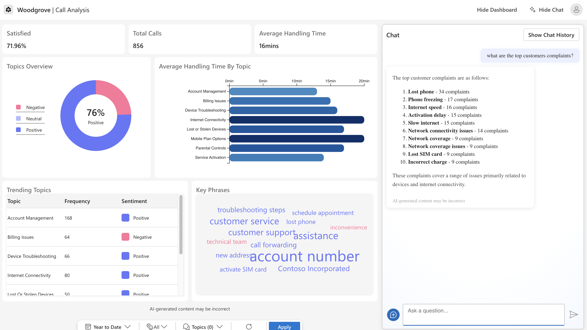
*Deployed web app on Azure App Service — native accelerator UI with RAG chatbot answering "what are the top customer complaints?" grounded in indexed transcripts*

## Custom Operations Dashboard

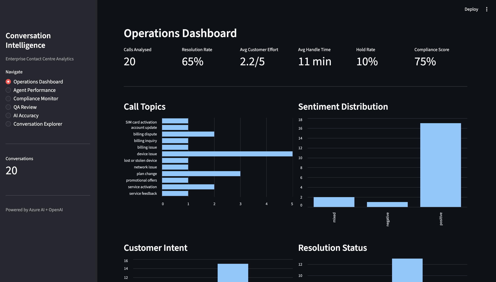
*Custom Streamlit dashboard built on top of the accelerator's data layer*

## Architecture

```
Call Transcripts
      │
      ▼
┌─────────────────────────────────────────────────────────────────────┐
│  Azure AI Search                                                     │
│  (Vector index over call transcripts, semantic search)               │
└──────────────────────────┬──────────────────────────────────────────┘
                           │
         ┌─────────────────┼─────────────────┐
         ▼                 ▼                 ▼
┌─────────────┐  ┌─────────────────┐  ┌──────────────────┐
│ Azure OpenAI │  │ Content          │  │ Azure Cosmos DB   │
│ GPT-4o-mini  │  │ Understanding    │  │ Chat history      │
│ Embeddings   │  │ Doc extraction   │  │ App state         │
└──────┬──────┘  └────────┬────────┘  └──────────────────┘
       │                  │
       ▼                  ▼
┌──────────────────────────────────────────┐
│  Analysis Pipeline (custom)               │
│                                           │
│  Structured extraction:                   │
│    sentiment, topic, intent, resolution,  │
│    agent ID, handle time, customer effort │
│                                           │
│  Compliance checking:                     │
│    6 rules x severity weighting           │
│    PII, greeting, escalation, resolution, │
│    empathy, upsell detection              │
└──────────────────┬───────────────────────┘
                   │
         ┌─────────┼─────────┐
         ▼         ▼         ▼
┌──────────┐ ┌──────────┐ ┌───────────────────────────┐
│ Azure SQL │ │ Storage   │ │ Operations Dashboard      │
│ Structured│ │ Account   │ │ (Streamlit)               │
│ metrics   │ │           │ │  - KPIs & analytics       │
└──────────┘ └──────────┘ │  - Agent performance       │
                           │  - Compliance monitor      │
┌──────────────────────┐   │  - QA review interface     │
│ Web App (App Service) │   │  - AI accuracy tracking   │
│ RAG chatbot + dashboard│  │  - Conversation explorer  │
└──────────────────────┘   └───────────────────────────┘
```

## What I Built

The base accelerator provides transcript ingestion, search indexing, and a RAG chatbot. Everything below is my addition.

### Automated Compliance Monitoring

`custom_extensions/04_compliance_check.py`

Pipeline that evaluates every call transcript against enterprise compliance rules using Azure OpenAI:

- **Structured conversation analysis** — extracts sentiment, primary/sub topic, customer intent, resolution status, agent name, hold detection, transfer detection, estimated handle time, and customer effort score (1-5) from each transcript
- **6 configurable compliance rules** with severity levels (critical/major/minor): PII disclosure, professional greeting, escalation offer, resolution confirmation, empathy demonstration, inappropriate upsell detection
- **Inverted logic handling** — rules like PII disclosure where "YES" means a violation are scored correctly
- Retry logic with exponential backoff for Azure OpenAI rate limits
- Results persisted to SQLite with separate tables for analysis, per-rule results, and per-conversation summary scores

### Operations Dashboard

`custom_extensions/app.py`

Single-page Streamlit application with six modules:

**Operations Dashboard** — Resolution rate, average handle time, customer effort score, hold rate, compliance score. Topic distribution, sentiment breakdown, customer intent analysis. Actionable table of unresolved/escalated calls requiring follow-up.

**Agent Performance** — Per-agent scorecard: call volume, resolution rate, average customer effort, handle time, hold frequency, transfer count, compliance score, critical/major violations. Automated coaching signals that flag agents needing training or immediate review based on threshold analysis.

**Compliance Monitor** — Aggregate compliance score, critical/major violation counts, clean call ratio. Per-rule pass rate chart, severity pivot table, searchable violation log with detail text. Compliance score distribution histogram.

**QA Review** — Side-by-side transcript and AI analysis display with inline compliance results. 6-dimension rating form (summary, sentiment, topic, resolution, compliance, agent tone). Sentiment correction and manual issue re-categorization. Reviewer tracking with duplicate prevention.

**AI Accuracy** — Accuracy metrics per dimension from QA reviews. Sentiment correction analysis showing where the model systematically errs. Low-confidence output flagging for retraining prioritization. Reviewer-assigned category distribution for comparison against AI classifications.

**Conversation Explorer** — Filterable table by topic, sentiment, and resolution status. Drill-down into any conversation showing full AI analysis, compliance results, and original transcript.

#### Dashboard Screenshots

| | |
|---|---|
| 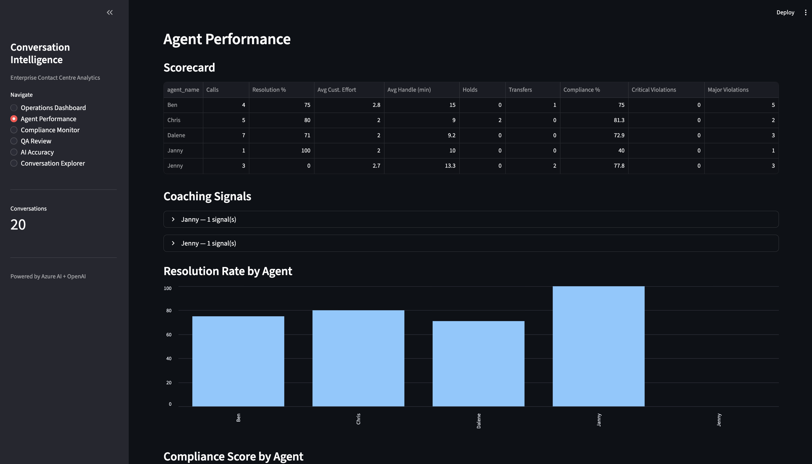 | 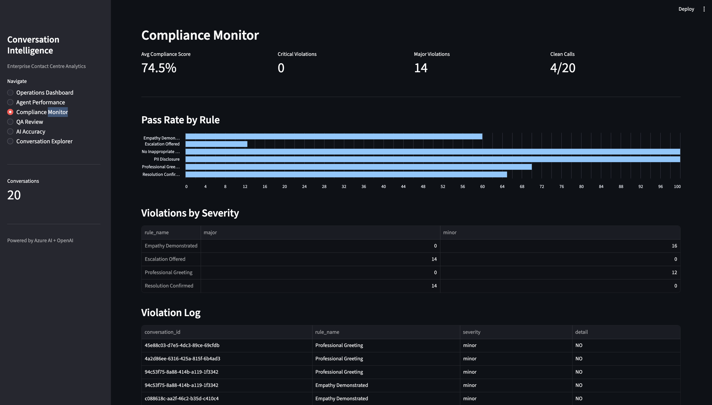 |
| *Agent Performance — per-agent scorecard with coaching signals* | *Compliance Monitor — per-rule pass rates and violation log* |
| 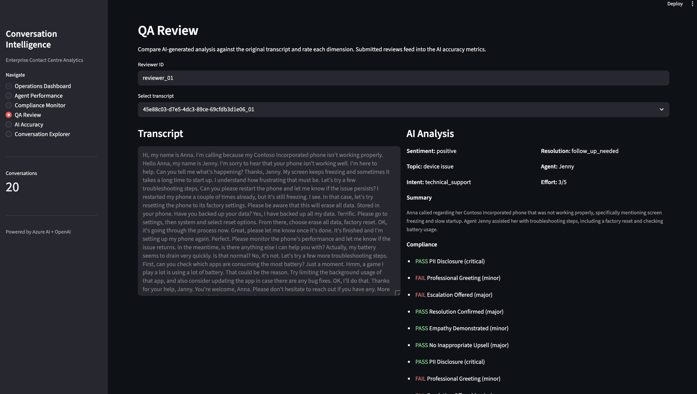 | 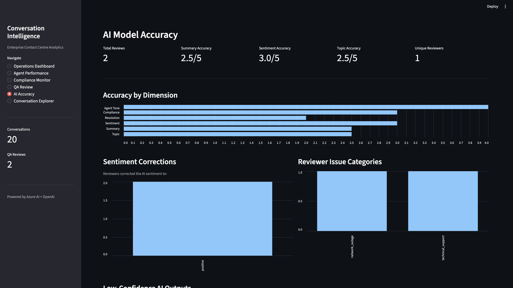 |
| *QA Review — side-by-side transcript vs AI analysis with 6-dimension rating* | *AI Accuracy — model correctness metrics from human review* |
| 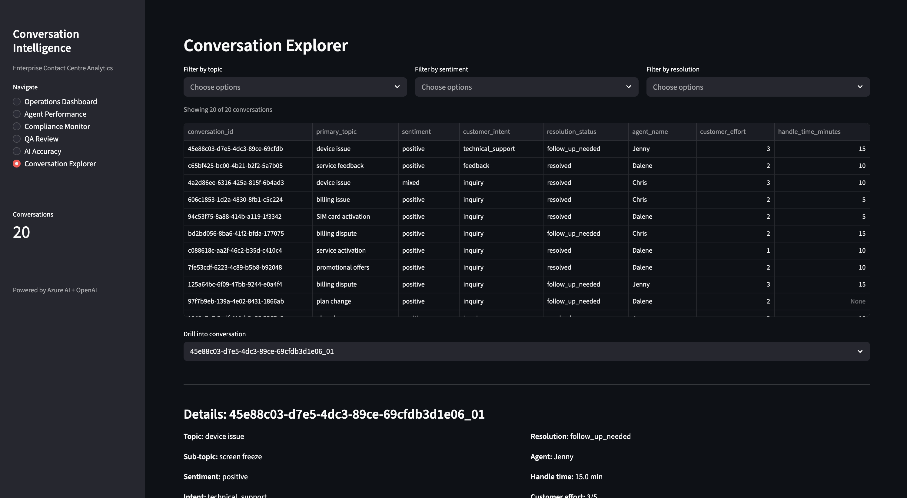 | |
| *Conversation Explorer — filterable drill-down into every call* | |

### Power BI Executive Dashboard

A second analytics surface built directly on top of the Azure SQL database populated by the pipeline. Aimed at business stakeholders who want summary-level insight without opening the operations app.

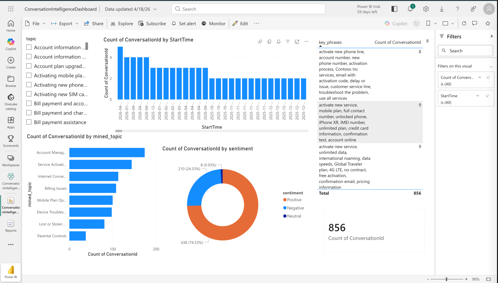

Connects Power BI Service to Azure SQL via a published semantic model, with visuals for:

- Total conversations analysed (distinct count)
- Sentiment distribution across all calls
- Call volume by mined topic
- Topic trends over time
- Key phrase frequency table
- Topic slicer for interactive filtering

| | |
|---|---|
| 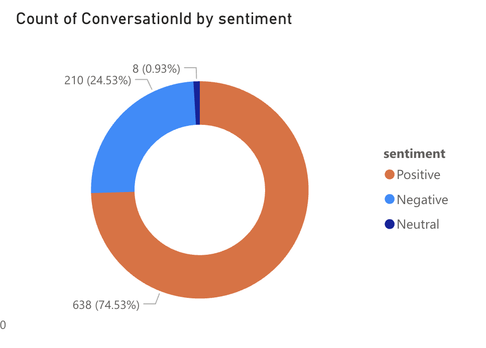 | 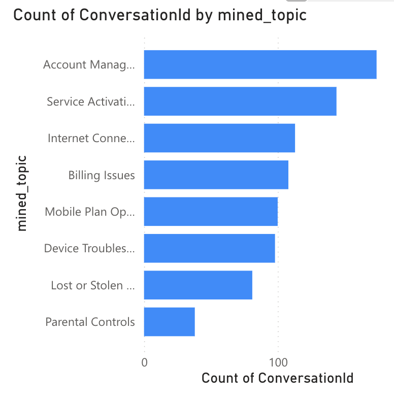 |
| *Sentiment distribution across all conversations* | *Call volume by mined topic* |

### Infrastructure Modifications

Patched the accelerator's Bicep templates to work with new Pay-As-You-Go Azure subscriptions:

- Changed SQL Server from Entra-ID-only auth to hybrid auth (AAD admin preserved for managed identity connections, SQL login added as fallback) — new PAYG subscriptions block AAD-only provisioning
- Changed SQL SKU from GP_S_Gen5 (serverless) to Basic tier — serverless SKU gated on new subscriptions
- Changed App Service Plan from B3 to B1 in a secondary region — new subscriptions have zero App Service quota in most regions
- Added parameterized `appServiceLocation` and `secondaryLocation` to support cross-region deployment when primary region has quota restrictions

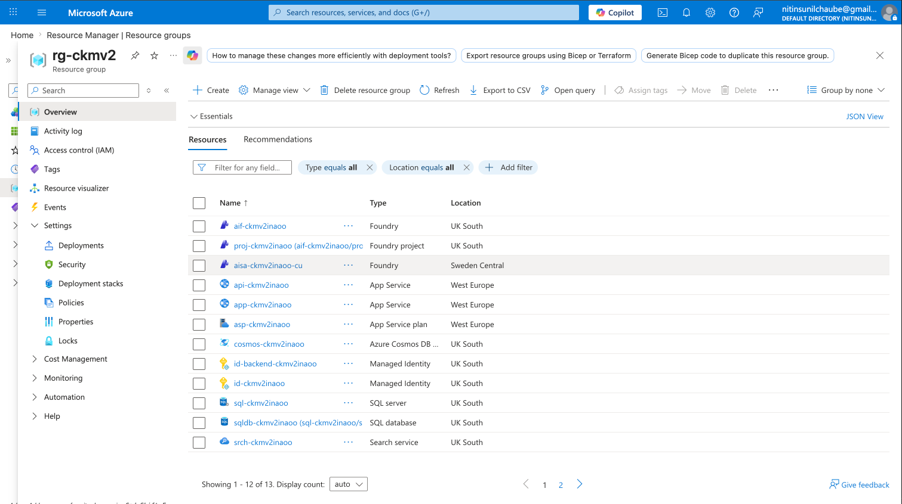
*Resource group view of all deployed infrastructure*

## Architectural Decisions

**Why native Azure services instead of Microsoft Fabric?**

The base accelerator uses Azure SQL for structured metrics and Azure AI Search as the semantic retrieval layer — the same medallion-style pattern Fabric provides via OneLake and Lakehouse, but composed from discrete services. This was kept deliberately because:

- Finer-grained cost control per service (Fabric capacities are billed continuously; native services scale to zero or near-zero)
- Existing Azure estates don't need a new analytics platform alongside their current investments
- Azure AI Search provides integrated vector search, which is required for the RAG chatbot and isn't native to Fabric Lakehouse
- Power BI connects directly to the Azure SQL semantic model, giving the same BI experience as Fabric without the capacity requirement

The pipeline could be ported to Fabric (Lakehouse + Data Engineering notebooks) by swapping the ingestion/storage layer; no AI or analytics logic would change.

## Tech Stack

| Component | Technology | Purpose |
|-----------|-----------|---------|
| LLM | Azure OpenAI (GPT-4o-mini) | Summarization, entity extraction, compliance evaluation, RAG answers |
| Search | Azure AI Search | Vector index over call transcripts, semantic retrieval |
| Document Processing | Azure Content Understanding | Transcript parsing and entity extraction |
| Application Data | Azure Cosmos DB | Chat history, conversation state |
| Structured Data | Azure SQL Database (Basic) | Operational metrics, structured query support |
| Object Storage | Azure Storage Account | Raw transcript files, processed outputs |
| Web Application | Azure App Service (Linux) | Containerized RAG chatbot and analytics dashboard |
| Analytics | Streamlit | Operations dashboard, QA review, compliance monitor |
| Infrastructure | Bicep + Azure Developer CLI | Automated deployment of all Azure resources |
| Language | Python | Pipeline logic, API backend, custom extensions |

## Getting Started

### Prerequisites

- Azure subscription (Pay-As-You-Go or higher)
- [Azure Developer CLI](https://learn.microsoft.com/en-us/azure/developer/azure-developer-cli/install-azd) >= 1.24.0
- [Azure CLI](https://learn.microsoft.com/en-us/cli/azure/install-azure-cli)
- Python 3.10+
- Contributor + Role Based Access Control Administrator roles on the subscription

### Deploy Infrastructure

```bash
azd auth login
az login

azd env new my-deployment
azd env set AZURE_LOCATION uksouth
azd env set AZURE_ENV_SECONDARY_LOCATION uksouth
azd env set AZURE_ENV_AI_SERVICE_LOCATION uksouth

azd up
```

When prompted, select `uksouth` for location and `telecom` for use case.

### Post-Deployment Setup

```bash
# Create AI agents
python -m venv .venv && source .venv/bin/activate
pip install -r requirements.txt
bash ./infra/scripts/run_create_agents_scripts.sh

# Grant permissions and load sample data
bash ./infra/scripts/process_sample_data.sh
```

### Grant RBAC for Custom Extensions

```bash
USER_ID=$(az ad signed-in-user show --query "id" -o tsv)
RG="<your-resource-group>"

# Cosmos DB data access
az cosmosdb sql role assignment create \
  --account-name <cosmos-account> \
  --resource-group $RG \
  --role-definition-id "00000000-0000-0000-0000-000000000002" \
  --principal-id $USER_ID \
  --scope "/"

# Azure OpenAI access
az role assignment create \
  --assignee $USER_ID \
  --role "Cognitive Services OpenAI User" \
  --scope "/subscriptions/<sub-id>/resourceGroups/$RG/providers/Microsoft.CognitiveServices/accounts/<ai-account>"

# AI Search read access
az role assignment create \
  --assignee $USER_ID \
  --role "Search Index Data Reader" \
  --scope "/subscriptions/<sub-id>/resourceGroups/$RG/providers/Microsoft.Search/searchServices/<search-account>"
```

### Run Custom Extensions

```bash
pip install -r custom_extensions/requirements.txt

# Run the analysis + compliance pipeline (processes 20 transcripts)
python custom_extensions/04_compliance_check.py

# Launch the operations dashboard
streamlit run custom_extensions/app.py
```

### Tear Down (stop all charges)

```bash
azd down --purge --force
```

## Project Structure

```
.
├── infra/
│   ├── main.bicep              # Primary IaC template (patched)
│   ├── main.parameters.json    # Deployment parameters
│   ├── modules/                # Bicep modules (web, AI, network)
│   └── scripts/                # Post-deployment setup scripts
├── src/
│   ├── api/                    # Backend API (Python, containerized)
│   └── App/                    # Frontend React application
├── custom_extensions/
│   ├── app.py                  # Operations dashboard (6 modules)
│   ├── 04_compliance_check.py  # Analysis + compliance pipeline
│   └── requirements.txt
├── documents/                  # Sample call transcript data
├── screenshots/                # Dashboard and deployment screenshots
├── tests/                      # Test suite
├── azure.yaml                  # azd configuration
└── README.md
```

## Cost Estimate

Running estimate with minimum SKUs:

| Resource | Monthly Cost |
|----------|-------------|
| App Service (B1) | ~$13 |
| Azure SQL (Basic) | ~$5 |
| Cosmos DB (serverless) | ~$25 |
| AI Search (Basic) | ~$25 |
| Azure OpenAI (usage-based) | ~$5 |
| Storage | ~$1 |
| **Total** | **~$75/month** |

Run `azd down --purge` when not actively using the deployment.

## License

This project extends Microsoft's [Conversation Knowledge Mining Solution Accelerator](https://github.com/microsoft/Conversation-Knowledge-Mining-Solution-Accelerator), provided under the MIT License. See [LICENSE](./LICENSE) for details.
